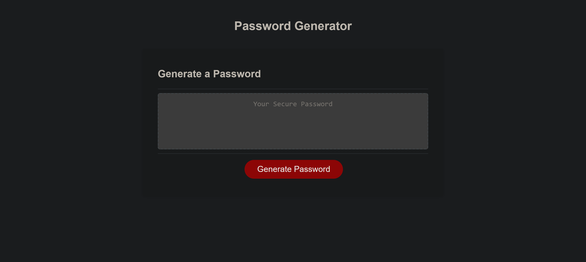

# Password Generator with JavaScript

## Description

I was given a password generator with full HTML and CSS. I was tasked with helping it function correctly by asking the user for specific password criterea.

- Password Length between 8 and 128 characters
- Do you want upppercase letters in your password?
- Do you want lowercase letters in your password?
- Do you want numbers in your password?
- Do you want symbols in your password?

Once all the questions are answered, the user is presented with a random password that is made available to copy and paste.

## Website Links

- Deployed URL: https://blakeedwards3.github.io/password-generator-javascript/
- GitHub Repository: https://github.com/blakeedwards3/password-generator-javascript

## Website Screenshot

## Credits

I used these resources to help understand what code to use to make the password generator work correctly.

- https://developer.mozilla.org/en-US/docs/Web/JavaScript/Reference/Global_Objects/parseInt
- https://developer.mozilla.org/en-US/docs/Web/JavaScript/Reference/Global_Objects/Number/isNaN
- https://htmlcheatsheet.com/js/
